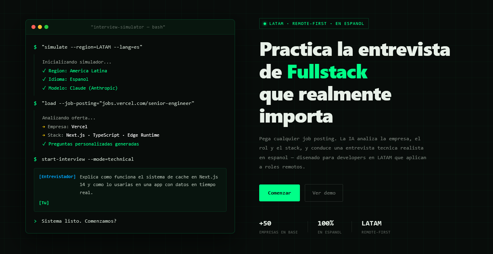
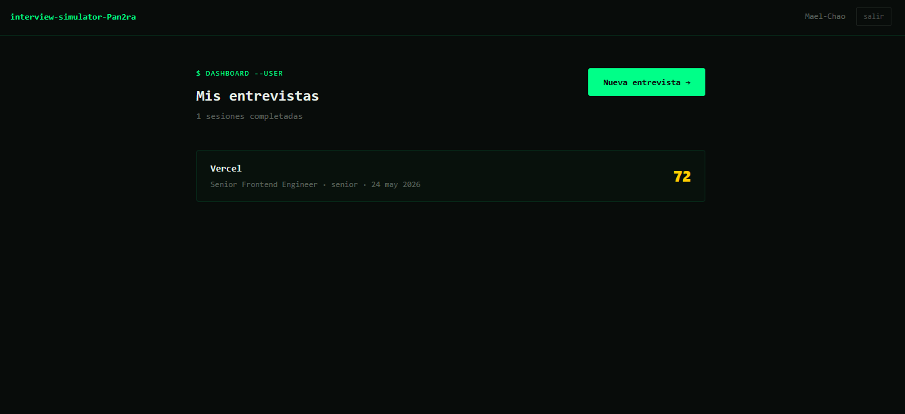
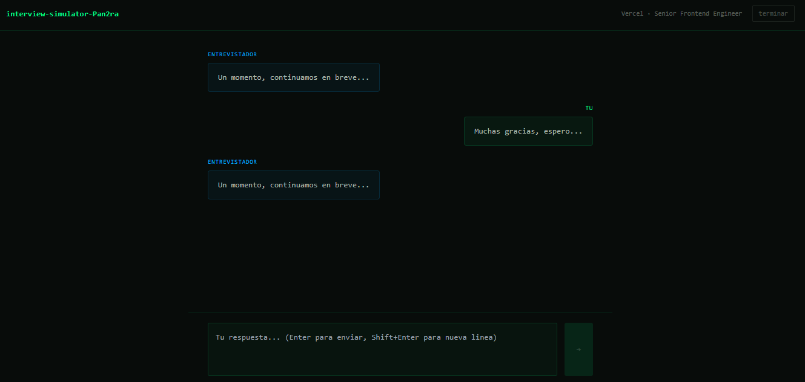
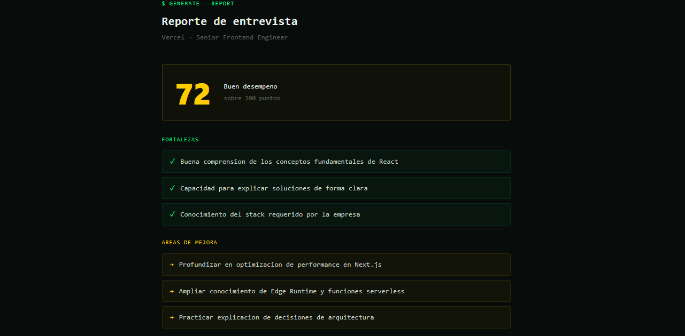

<div align="center">

# Pan2ra

**Simulador de entrevistas técnicas para developers en LATAM**

*"La esperanza fue lo último que quedó en la caja."*

[](https://nextjs.org)
[](https://fastapi.tiangolo.com)
[](https://supabase.com)
[](https://www.typescriptlang.org)
[](https://vercel.com)

[**Demo en vivo →**](https://pan2ra.vercel.app)

</div>

---

## ¿Qué es Pan2ra?

Pan2ra es un simulador de entrevistas técnicas diseñado específicamente para developers en América Latina que aplican a roles remotos.

Pega cualquier job posting. La IA analiza la empresa, el rol y el stack requerido, y conduce una entrevista técnica realista en español. Al terminar, genera un reporte con tu score, fortalezas, áreas de mejora y un plan de estudio personalizado.

**El problema que resuelve:** los developers en LATAM enfrentan entrevistas en inglés para empresas con culturas que no conocen, sin poder practicar en su idioma ni con el contexto correcto. Pan2ra cierra esa brecha.

---

## Screenshots

| Landing | Dashboard |
|---|---|
|  |  |

| Entrevista | Reporte |
|---|---|
|  |  |

---

## Features

- **Parser de job postings** — analiza cualquier oferta en inglés o español y extrae empresa, rol, stack, nivel y cultura
- **Entrevista personalizada** — preguntas generadas específicamente para el puesto, en español, con contexto LATAM
- **Chat en tiempo real** — interfaz de entrevista conversacional con el entrevistador IA
- **Reporte con score** — fortalezas, áreas de mejora, patrones detectados y plan de estudio semanal
- **Historial de sesiones** — tracking de progreso entre entrevistas
- **Auth con GitHub** — login en un click para developers, con opción de magic link

---

## Tech Stack

| Capa | Tecnología |
|---|---|
| Frontend | Next.js 14 App Router, TypeScript, Tailwind CSS |
| Backend | FastAPI (Python) |
| Base de datos | Supabase (PostgreSQL) |
| Auth | Supabase Auth — GitHub OAuth + Magic Link |
| IA | Gemini API (Google) |
| Deploy | Vercel (frontend) + Railway (API) |

---

## Arquitectura

```
pan2ra/
├── app/                          # Next.js 14 App Router
│   └── src/
│       ├── app/
│       │   ├── (auth)/           # Login, callback
│       │   ├── dashboard/        # Dashboard, nueva sesión, chat, reporte
│       │   └── api/              # API routes — jobs, interview, save
│       └── lib/
│           └── supabase/         # Client y server clients
├── api/                          # FastAPI
│   ├── routers/
│   └── services/
└── supabase/
    └── migrations/               # Schema SQL
```

**Decisión de arquitectura:** las llamadas a la IA viven en Next.js API routes (no en FastAPI) para aprovechar el edge network de Vercel y evitar restricciones geográficas. FastAPI está preparado para manejar lógica de sesiones y streaming en fases futuras.

---

## Base de datos

```sql
users          — perfiles sincronizados con auth.users
job_postings   — ofertas analizadas con stack y metadata
sessions       — sesiones de entrevista con estado y timestamps
messages       — conversación completa de cada sesión
reports        — score, fortalezas, debilidades y plan de estudio
```

Row Level Security habilitado en todas las tablas — cada usuario solo accede a sus propios datos.

---

## Setup local

### Prerrequisitos

- Node.js 18+
- Python 3.11+
- Cuenta en [Supabase](https://supabase.com)
- API key de Gemini ([Google AI Studio](https://aistudio.google.com))

### 1. Clonar el repo

```bash
git clone https://github.com/Mael-Chao/pan2ra.git
cd pan2ra
```

### 2. Frontend

```bash
cd app
npm install
```

Crea `app/.env.local`:

```bash
NEXT_PUBLIC_SUPABASE_URL=tu_supabase_url
NEXT_PUBLIC_SUPABASE_ANON_KEY=tu_anon_key
GEMINI_API_KEY=tu_gemini_key
NEXT_PUBLIC_SITE_URL=http://localhost:3000
```

```bash
npm run dev
```

### 3. Backend

```bash
cd api
python -m venv venv
source venv/bin/activate  # Windows: venv\Scripts\activate
pip install -r requirements.txt
```

Crea `api/.env`:

```bash
GEMINI_API_KEY=tu_gemini_key
SUPABASE_URL=tu_supabase_url
SUPABASE_SERVICE_KEY=tu_service_role_key
```

```bash
uvicorn main:app --reload --port 8000
```

### 4. Supabase

Ejecuta el schema en **SQL Editor**:

```sql
create table job_postings (
  id uuid primary key default gen_random_uuid(),
  user_id uuid references auth.users(id) on delete cascade,
  company_name text,
  role text,
  stack text[],
  level text,
  parsed_data jsonb,
  created_at timestamp with time zone default now()
);

create table sessions (
  id uuid primary key default gen_random_uuid(),
  user_id uuid references auth.users(id) on delete cascade,
  job_posting_id uuid references job_postings(id) on delete cascade,
  role text,
  level text,
  language text default 'es',
  status text default 'active',
  started_at timestamp with time zone default now(),
  ended_at timestamp with time zone
);

create table messages (
  id uuid primary key default gen_random_uuid(),
  session_id uuid references sessions(id) on delete cascade,
  role text,
  content text,
  created_at timestamp with time zone default now()
);

create table reports (
  id uuid primary key default gen_random_uuid(),
  session_id uuid references sessions(id) on delete cascade,
  user_id uuid references auth.users(id) on delete cascade,
  strengths text[],
  weaknesses text[],
  patterns text,
  study_plan text,
  score integer,
  created_at timestamp with time zone default now()
);
```

Habilita RLS y configura GitHub OAuth en **Authentication → Providers**.

---

## Roadmap

- [ ] Integración completa con IA en producción
- [ ] Diseño responsivo (mobile/tablet)
- [ ] Modo de práctica por tema (React, Node.js, System Design)
- [ ] Comparativa de scores entre sesiones
- [ ] Exportar reporte en PDF
- [ ] Soporte multiidioma (portugués para Brasil)

---

## Autor

**Ismael Pérez** — Full Stack Developer

[GitHub](https://github.com/Mael-Chao)
---

<div align="center">
  <sub>Construido con Next.js 14, FastAPI, Supabase y mucha esperanza.</sub>
</div>